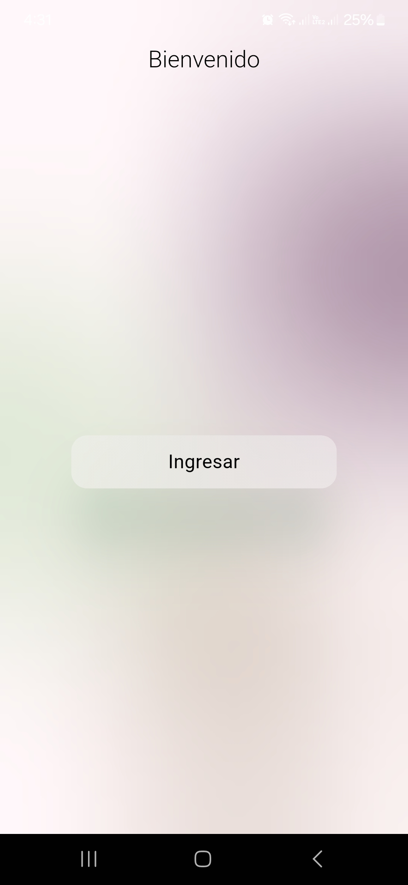
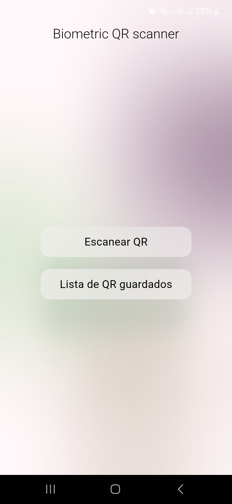
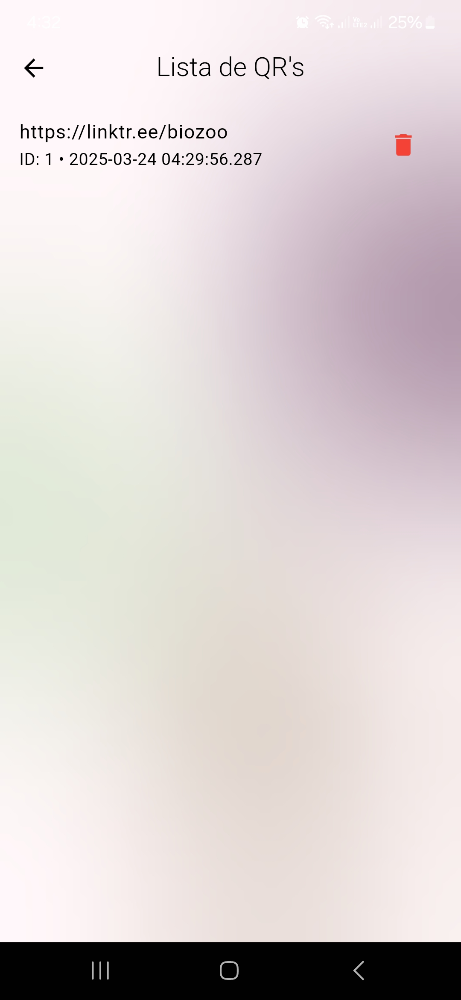
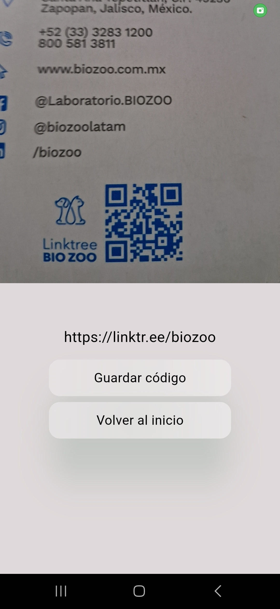

# 📱 Biometric QR Scanner

Una aplicación Flutter para escanear códigos QR con autenticación biométrica o PIN. 🚀  
Funciona con cámara nativa, Room Database en Android y almacenamiento seguro con `EncryptedSharedPreferences`.

---

## 🧠 Funcionalidades

✅ Escaneo de códigos QR usando **CameraX** y **ML Kit**  
✅ Autenticación mediante **biometría (huella o rostro)** usando `BiometricPrompt`  
✅ Alternativa de autenticación con **PIN** en caso de que el dispositivo no tenga sensores biométricos  
✅ Almacenamiento seguro de PIN con `EncryptedSharedPreferences`  
✅ Base de datos local en Android usando **Room**  
✅ Guardado de códigos escaneados en SQLite  
✅ Listado y eliminación de códigos guardados  
✅ Arquitectura basada en **Clean Architecture** + **Cubit**  
✅ Comunicación nativa Flutter ↔️ Android con **Pigeon** y **Platform Channels**

---

## 📸 Capturas de pantalla

  
  
  
  

---

## 📦 Instalación del APK

1. Descargá el archivo [`app-release.apk`](apk/app-release.apk)
2. Copialo a tu dispositivo Android
3. Asegurate de habilitar la opción **"Permitir instalar apps de fuentes desconocidas"**
4. Instalalo y ¡listo para usar! 🎉

---

## 🔧 Requisitos

- Android 8.0 (API 26) o superior
- Sensor biométrico (huella o rostro) o capacidad de ingreso PIN
- Permiso para usar cámara

---

## 🧱 Arquitectura del proyecto

- `lib/feature/auth`: Módulo de autenticación (biometría/PIN)
- `lib/feature/qr_scanner`: Escaneo y guardado de QR
- `lib/feature/qr_list`: Listado y eliminación de QR guardados
- `android/`: Implementación nativa (biometría, Room, permisos, etc.)
- `pigeons/`: Archivo `.dart` que genera la comunicación Flutter ↔️ Android

---

## 🛠️ Tecnologías utilizadas

- Flutter + Dart
- Kotlin (Android nativo)
- Room Database
- BiometricPrompt API
- EncryptedSharedPreferences
- Pigeon
- Bloc / Cubit
- GoRouter
- CameraX + ML Kit

---

## 🔨 Cómo ejecutar el proyecto localmente

¿Querés clonar y ejecutar el proyecto en tu máquina? Seguí estos pasos:

### 1️⃣ Requisitos previos

- ✅ [Flutter SDK](https://docs.flutter.dev/get-started/install) (recomendado: versión estable)
- ✅ [Android Studio](https://developer.android.com/studio) (con emulador o dispositivo físico)
- ✅ Tener configurado un emulador o conectar tu teléfono por USB
- ✅ Android SDK (incluido en Android Studio)

### 2️⃣ Clonar el repositorio

## ✨ Autor

Desarrollado por Hensell.

---
